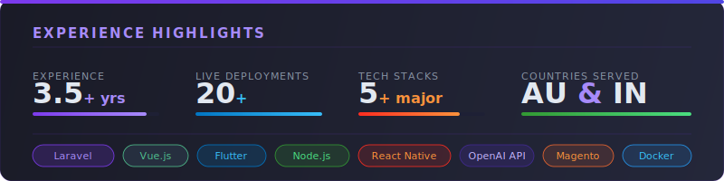

<div align="center">

<a href="https://git.io/typing-svg">
  
</a>

<br/><br/>

[](https://arnab.wisestaging.com/)
[](https://www.linkedin.com/in/arnab-som-012568160/)
[](https://github.com/Captain-Arnab)
[](mailto:arnabrks@gmail.com)
[](https://x.com/som_arnab)
[](https://www.instagram.com/cap_arnab/)

<br/>


</div>

---

## 👨‍💻 About Me

<table>
<tr>
<td valign="top" width="60%">

```yaml
Name        : Arnab Som
Location    : Howrah, West Bengal, India
Role        : Senior Full Stack Developer
Experience  : 3.5+ Years | 20+ Live Deployments
Current     : Outposter South Asia (Remote, AU)
Education   : B.Tech CSE
Availability: Immediate | Open to Remote & Relocation
Languages   : English · Bengali · Hindi

Currently_building:
  - AI-powered Talent Platform @ Outposter
  - B2B Grocery Order Management System

Strengths:
  - End-to-end product ownership
  - REST API design & 3rd-party integrations
  - Cross-platform mobile (Flutter & React Native)
  - Junior developer mentoring
  - Remote-first international collaboration
```

</td>
<td valign="middle" width="40%" align="center">


</td>
</tr>
</table>

---

## 🏢 Work Experience

<details>
<summary><b>🟣 Senior Full Stack Developer — Outposter South Asia Pvt Ltd</b> &nbsp;|&nbsp; Nov 2024 – Present &nbsp;|&nbsp; Remote (Brisbane, AU)</summary>
<br/>

- Built the **Outposter Talent Platform** from scratch — Client Portal, Job Portal, Admin Panel — full architecture to delivery
- Engineered an **AI-powered JD parsing system** using OpenAI API + OCR for smart candidate matching
- Designed REST APIs integrating **Kap1 CRM** — candidate search, lead tracking, resume workflows
- Integrated **Slack Webhooks**, **Turnstile CAPTCHA**, and **Calendly** for automation & security
- Leading Vue.js frontend development; mentoring junior developers and supervising project delivery
- Managing parallel streams: Python data scraping, Laravel backends, Flutter & React Native mobile apps

</details>

<details>
<summary><b>🔵 PHP Developer — Infedis InfoTech LLP</b> &nbsp;|&nbsp; Jan 2024 – Oct 2024 &nbsp;|&nbsp; Remote (Kolkata)</summary>
<br/>

- Core backend developer for **Hidoc** — a healthcare-focused clinical platform
- Maintained and extended PHP backend systems across the product lifecycle
- Delivered work consistently to quality standards across team sprints

</details>

<details>
<summary><b>🟠 Web Developer — Rupa & Company Ltd</b> &nbsp;|&nbsp; Dec 2022 – Dec 2023 &nbsp;|&nbsp; Kolkata</summary>
<br/>

- Maintained Magento storefronts for **rupa.co.in** and **femmora.com** (India's top textile brand)
- Built an internal **Sales Portal** using CodeIgniter
- Led full **WordPress → Magento** migration

</details>

---

## 🛠️ Tech Stack

<div align="center">

**Languages**


**Frameworks & Runtime**


**Frontend & Styling**


**Databases & Cloud**


**APIs, DevOps & Tools**


</div>

---

## 🚀 Featured Projects

> 20+ live deployments across web and mobile platforms

| # | Project | Stack | Description | Live |
|---|---------|-------|-------------|------|
| 🤖 | **Outposter Talent Platform** | Vue.js · Laravel · OpenAI · OCR | AI-powered 3-portal talent system — client, job & admin portals | [↗ Visit](https://talent.outposter.com.au) |
| 🛒 | **Urban Roots** | Flutter · Laravel | Grocery store with user & delivery driver mobile apps | [↗ Visit](https://urbunroots.com) |
| 💰 | **AntVault** | Laravel · Vue.js | Stock & SIP investment fintech platform | [↗ Visit](https://antvault.in) |
| 🧹 | **Zencare** | Flutter · Laravel | Service marketplace + Android app | [↗ Visit](https://zencareservice.com) |
| 💆 | **Elegance Laser Clinics** | Laravel | Clinic website + custom blog admin | [↗ Visit](https://elegancelaserclinics.com) |
| 👕 | **Rupa Corporate** | Magento | E-commerce for India's top textile brand | [↗ Visit](https://rupa.co.in) |
| 📈 | **Omnifincon** | Laravel · Vue.js | Wealth management platform | [↗ Visit](https://omnifincon.com) |
| 🏨 | **Gold Horn Hotel** | Laravel | Hotel booking & events platform | [↗ Visit](https://goldhornhotel.com) |
| 🎓 | **MiCampus** | Flutter · Laravel | College event management + Android app | — |
| ⚡ | **Ontrack Energy** | Laravel | Corporate website | [↗ Visit](https://ontrackenergy.com) |

---

## 📊 GitHub at a Glance

<div align="center">

<!-- Streak stats — hosted on demolab, not vercel, very reliable -->


<br/><br/>

<!-- Activity graph — ssr hosted, reliable -->


</div>

---

## 🎯 Experience Highlights

<div align="center">



</div>

---

## 💬 A Dev Quote

<div align="center">


</div>

---

## 📬 Let's Connect

<div align="center">

**Open to remote full-stack / backend roles, freelance engagements, and interesting builds.**

<br/>

[](https://arnab.wisestaging.com/)
&nbsp;
[](mailto:arnabrks@gmail.com)
&nbsp;
[](https://www.linkedin.com/in/arnab-som-012568160/)

<br/><br/>

---

*Made with ❤️ from Howrah, West Bengal, India*


</div>
